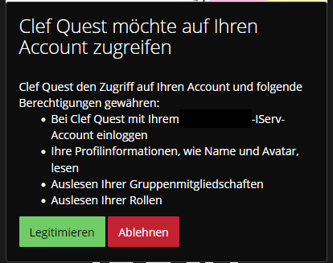
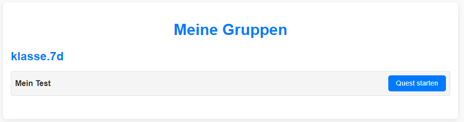

# Funktionen

Beim Aufrufen der Seite wird ein Single-Sign-On mit IServ durchgeführt und die Rolle (Schüler/Lehrer) ausgelesen.



## Ansicht einer Lehrkraft


### Gruppenübersicht

Hier können Lerngruppen ausgewählt und für die App aktiviert werden. Alle nicht aktivierten Lerngruppen bleiben zur besseren Übersicht inaktiv, bis sie hier aktiviert werden.


### Testübersicht

Hier können einzelne Tests oder Gruppen angeklickt und die Ergebnisste ausgewertet werden.


### Tests erstellen

Damit jeder Schüler einen eigenen Test erhalten kann, müssen wir eine Vorlage anlegen. Diese Vorlage wird "Test" genannt, die einzelne Version, die vom Schüler ausgefüllt wird, wird "Quest" genannt.


### Stages

Für jeden Test lassen sich mehrere "Stages" erstellen, jeweils mit einem typischen Aufgabenrtyp (z. B.: Notenlesen, Intervalle, Tonleitern, etc.). Diese haben jeweils einzelne Einstellungen und können später einzeln gewichtet und bewertet werden.


### Auswertung
Beispiel der Auswertung für eine fiktive Lerngruppe mit dem Schüler Testus.Nutzerus und 6 Tests mit jeweils 1-3 Stages.


## Ansicht der Lernenden

SuS sehen offene Tests ihrer Lerngruppen im Hauptmenü. Mit Klick auf "Quest starten" wird für sie nach Vorlage ein zufälliger Durchlauf generiert.



### Aufgaben

Die Aufgaben werden einzeln mit Hilfen und passenden Mehrfachauswahlen angezeigt. In diesem Fall sind nur Dur / Moll möglich, daher sind die falschen Antworten limitert. Üblicherweise werden vier Möglichkeiten angezeigt.


### Feedback

Direkt nach einer Aufgabe und am Ende in einer Gesamtübersicht erhalten die SuS ein Sofortfeedback über ihre Leistungen.


# Einrichtung

ClefQuest wird per Docker auf einem Server gestartet. Ein entsprechendes Image liegt nach Veröffentlichung in den Releases vor. 

Zum Starten bedarf es einer Docker Compose Datei "compose.yml" und einer Datei ".env", in welcher geheime Schlüssel der eigenen Instanz festgelegt werden.

## Docker Dompose
```sh
networks:
  clefquest_network:

volumes:
  clefquest_db:
  redis_data:
  
services:
  clefquest:
    image: clefquest:latest
    container_name: clefquest_app
    restart: always
    networks:
      - clefquest_network
    ports:
      - "PORT_HIER_ANGEBEN:5000"
    env_file:
      - .env
    depends_on:
      redis:
        condition: service_healthy
    volumes:
      - clefquest_db:/instance/
    healthcheck:
      test: ["CMD", "curl", "-f", "http://localhost:5000/health"]
      interval: 10s
      timeout: 5s
      retries: 3
      start_period: 5s

  redis:
    image: redis:latest
    container_name: clefquest_redis
    restart: unless-stopped
    networks:
      - clefquest_network
    volumes:
      - redis_data:/data
    healthcheck:
      test: ["CMD", "redis-cli", "--raw", "incr", "healthcheck"]
      interval: 5s
      timeout: 3s
      retries: 5
      start_period: 3s
```
Hier muss der Port im eigenen Server selbstständig gewählt und mit einem Reverse Proxy ggfls. abgestimmt werden.

## .env

```yaml
OAUTHLIB_INSECURE_TRANSPORT=1
SERVER_DOMAIN=

SECRET_KEY=

ISERV_CLIENT_ID=
ISERV_CLIENT_SECRET=
ISERV_CLIENT_DOMAIN=
```

Die IServ-Daten werden bei Einrichtung des Single-Sign-Ons von IServ angezeigt. 

# IServ

## SSO einrichten
Anleitung hier folgen: [SSO einrichtung](https://doku.iserv.de/manage/system/sso/).

```yaml
Name: Patchwerk
Vertrauenswürdig: Nein
Client-ID: (wird von IServ generiert)
Client-Geheimnis: (wird von IServ generiert)
Rollen: Lehrer
Erlaubte Grant-Typen: Autorisierungs-Code
Auf Scopes Einschränken: E-Mail, OpenID, Profil, Gruppen, WebUntis
Weiterleitungs-URIs: ["SERVER_DOMAIN" hier eingeben]/auth
```

## Navigation in Iserv einrichten
https://doku.iserv.de/manage/system/menuitems/

```yaml
Name: Patchwerk
URL: https://meine.domain.der.app.de
Icon: beliebig
Ziel: Neue Seite
Zugriff auf LAN beschränken: Nein
Gruppen: Lehrer, Admins
Aktiv: Ja
```